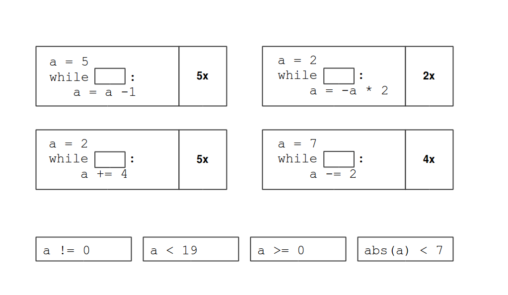

# Control flow statements

Control flow means controlling, which instruction is handled next. In this tutorial, we cover three of Pythons control flow statements: `for`, `if` and `while`.

## Loops with for

The `for` loop allows you to repeat one or more instructions. It requires a sequence of items that the loop iterates over. This can be a list, a tuple, a string, a dictionary or any iterator-like object (e.g. a file). Some examples:

    for i in range(3):
        print(i)

    for char in 'ABCD':
        print(char)

    for elem in [1,2,3,4]:
        print(elem)

### When to use for?

* When you want to do something for all elements of a list.
* When the number of iterations is known at the beginning.
* Printing numbers, concatenating a list of strings.
* Modifying all elements of a list.

## Conditional statements with `if`

if statements are used to implement decisions and branching in the program. They must contain an `if` block, and zero or more `elif`'s and an optional `else` block:

    if fruit == 'apple':
        price = 0.55
    elif fruit == 'banana':
        price = 0.75
    elif fruit == 'orange':	
        price = 0.80
    else:
        print 'we dont have %s'%(fruit)

### Boolean value of variables

Each variable can be interpreted as a boolean (`True`/`False`) value. All values are treated as `True`, except for:

    False
    0
    []
    ''
    {}
    set()
    None

### Comparison operators
An `if` expression may contain comparison operators like:

    a == b
    a != b
    a < b
    a > b
    a <= b
    a >= b
    a in b  # when b is a list

Multiple expressions can be combined with boolean logic:

    a or b
    a and b
    not a
    (a or b) and (c or d)

## Conditional loops with while

### Exercise
Match the expressions so that the `while` loops run the designated number of times.

While loops combine `for` and `if`. They require a conditional expression at the beginning. The conditional expressions work in exactly the same way as in `if.. elif` statements.

    i = 0
    while i < 5:
        print (i)
        i = i + 1)

### When to use while?

* When there is an exit condition.
* When it may happen that nothing is done at all.
* When the number of repeats depends on user input.
* Searching for a particular element in a list.

## Code blocks

After an `for`, `if` or `while` statement, all indented commands are treated as a code block, and are executed if the condition applies.
The next unindented command is executed in any case.

## Quiz Questions

#### 1. Which of these `for` commands are correct?

- [ ] `for char in "ABCD":`
- [ ] `for i in range(10):`
- [ ] `for num in (4, 6, 8):`
- [ ] `for k in 3+7:`
- [ ] `for (i=0; i<10; i++):`
- [ ] `for var in seq:`

#### 2. Which of these `if` statements are syntactically correct?

- [ ] `if a and b:`
- [ ] `if len(s) == 23:`
- [ ] `if a but not b < 3:`
- [ ] `if a ** 2 >= 49:`
- [ ] `if a != 3`
- [ ] `if (a and b) or (c and d):`

#### 3. Which of these `while` commands are correct?

- [ ] `while a = 1:`
- [ ] `while b == 1`
- [ ] `while a + 7:`
- [ ] `while len(c) > 10:`
- [ ] `while a and (b-2 == c):`
- [ ] `while s.find('c') >= 0:`

#### 4. Which statements are correct?

- [ ] `while` is also called a conditional loop
- [ ] The expression after `while` may contain function calls
- [ ] It is possible to write endless `while` loops
- [ ] The colon after `while` may be omitted
- [ ] The code block after `while` is executed at least once

