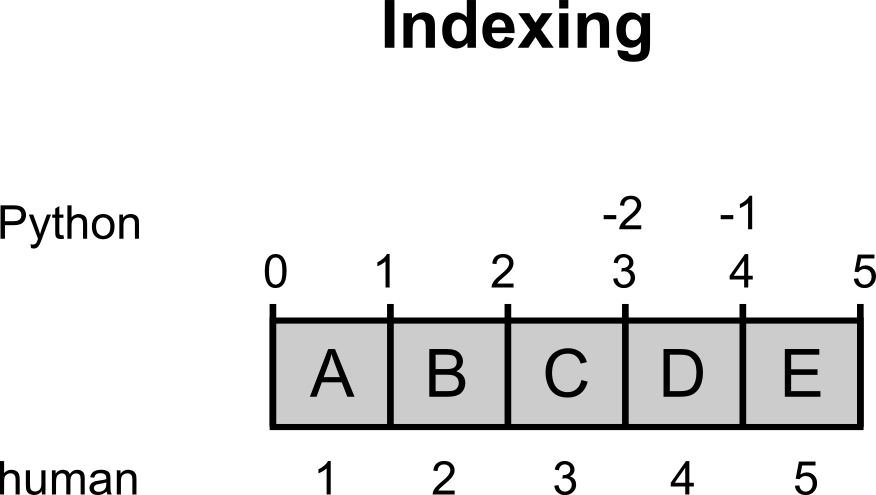

# Listen

Um größere Datenmengen zu verarbeiten, können wir nicht für jeden Eintrag einen neuen Variablennamen ausdenken. Irgendwie muß es möglich sein, mehrere Datensätze in einer Variable zu speichern. In Python treten an dieser Stelle **Listen** auf die Bühne.

Listen sind eine einfache Abfolge von Elementen. Allerdings zählt Python anders als Menschen:

