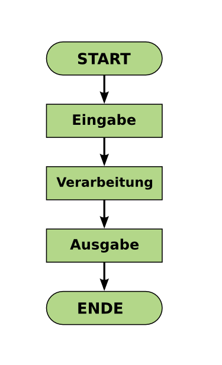

# Programme schreiben

Ein Programm besteht aus mehreren Zeilen, die in einem Rutsch ausgeführt werden.

Zu einem Programm gehören normalerweise folgende Schritte:

Im Detail können Programme natürlich sehr viel komplizierter werden.

In diesem Teil werden wir die Funktion `print()` zur Ausgabe, Schleifen und Verzweigungen kennen lernen.

## Turing-Vollständigkeit

Sobald wir Zahlen und Strings verarbeiten und Schleifen und Verzweigungen einsetzen können, haben wir einen wichtigen theoretischen Meilenstein erreicht: Theoretisch sind wir nach diesem Kapitel in der Lage, jedes erdenkliche Programm zu schreiben. Informatiker nennen das *"Turing-vollständig"*. 

Trotzdem geht der Kurs natürlich noch weiter, denn *"Turing-vollständig"* bedeutet nicht automatisch *"schnell und bequem"*.

Du kannst alle weiteren Python-Befehle als mögliche *bequeme Arbeitserleichterung* betrachten. Zum Glück gibt es davon in Python recht viele.
