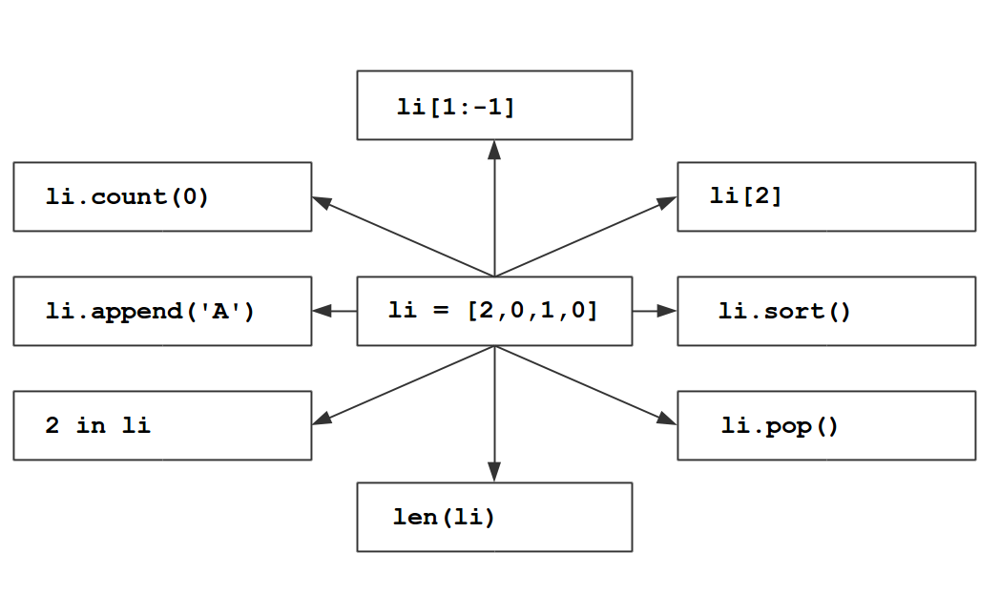

# Storing lists of items

To handle larger amounts of data, we cannot invent a new variable for every new data item. Somehow we need to put more data into one variable. This is where Python lists come in.

## Warming up

Find out what each of the expressions does to the list in the center.

## Exercises

### Exercise 1

What does the list b contain?

    a = [8, 7, 6, 5, 4]
    b = a[2:4]

- [ ] `[7, 6, 5]`
- [ ] `[7, 6]`
- [ ] `[6, 5]`
- [ ] `[6, 5, 4]`

### Exercise 2

Use the expressions to modify the list as indicated. Use each expression once.

### Exercise 3

Use the expressions to modify the list as indicated. Use each expression once.

## The Challenge: Percentage of top 10 names

In the year 2000, a total of 1962406 boys were registered born in the U.S. What percentage of the total names do the top 10 names consist?

Write a program to calculate that number.

| name    | number |
|---------|--------|
| Jacob | 34465 |
| Michael | 32025 |
| Matthew | 28569 |
| Joshua | 27531 |
| Christopher | 24928 |
| Nicholas | 24650 |
| Andrew | 23632 |
| Joseph | 22818 |
| Daniel | 22307 |
| Tyler | 21500 |

## Hint

If you are using Python2, you need to specify whether you want numbers with decimal places when dividing. That means

    3 / 4 

gives a different result than
 
    3.0 / 4

However, Python 3 automatically creates the decimal places if needed.
