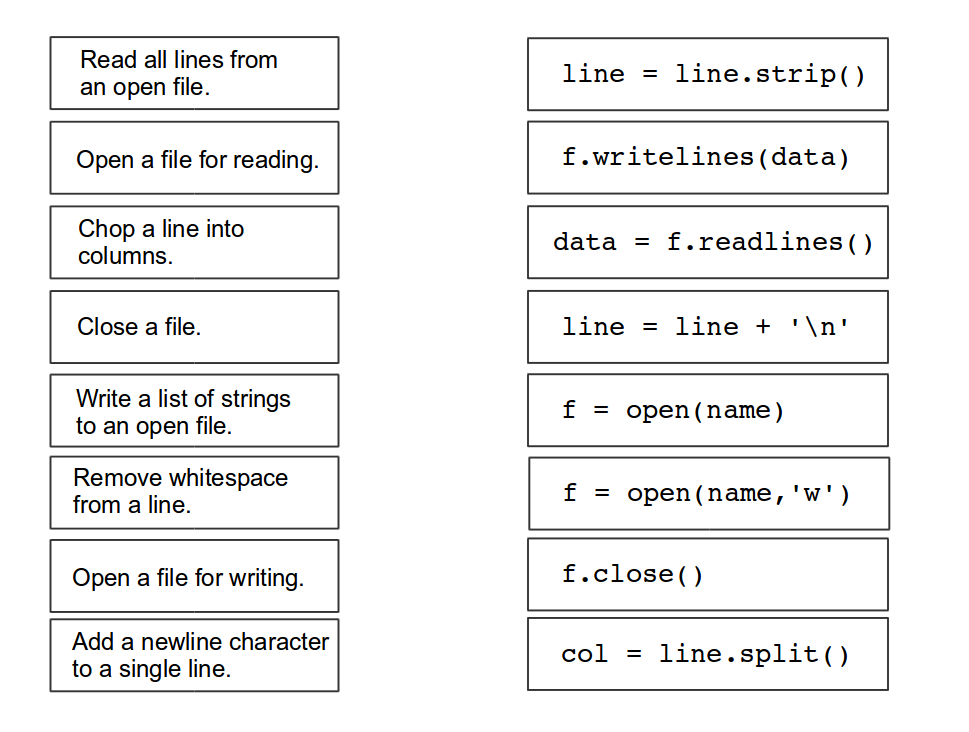

# Writing Files

### Exercise 1

Form pairs of Python commands and their meanings.

### Exercise 2

Execute the following program. Explain what happens.

    names = ['Adam', 'Bob', 'Charlie']

    f = open('boys.txt', 'w')
    for name in names:
        f.write(name + '\n')
    f.close()

### Exercise 3

Remove the `+ '\n'` from the program and execute it again. What happens?

### Exercise 4

Complete the following statements by `int()` or `str()` so that all of them work.

     In [1]: 9 + 9

     In [2]: 9 + '9'

     In [3]: '9' + '9'

     In [4]: 9 * '9'

### Exercise 5

Write a program that writes the following data into a two-column text file.

    names = ["Emma", "Olivia", "Sophia", "Isabella",
             "Ava", "Mia", "Emily"]
    values = [20799, 19674, 18490, 16950,
               15586, 13442, 12562]
